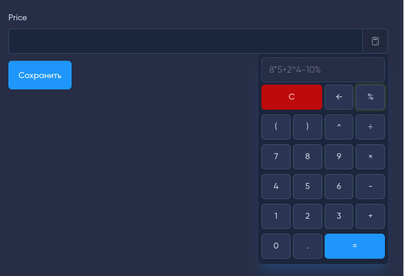
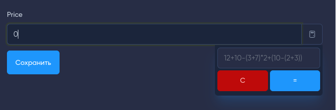

# Input extension - калькулятор

[](https://github.com/forest-lynx/moonshine-input-extension-calculator)
[](https://github.com/forest-lynx/moonshine-input-extension-calculator) 
[](LICENSE)\
[](Laravel) 
[](PHP) 
[](https://github.com/moonshine-software/moonshine)

Documentation in [English](./doc/README-EN.md)

Input extension для отображения калькулятора у поля к административной панели [MoonShine](https://moonshine-laravel.com/). 

## Содержание
* [Установка](#установка)
* [Использование](#использование)
* [Лицензия](#лицензия)

## Установка
Команда для установки:
```bash
composer require forest-lynx/moonshine-input-extension-calculator
```
## Использование
```php
<?php
//...
use ForestLynx\MoonShine\InputExtensions\Calculator;
//...
Text::make('Price')
    ->extension(new Calculator());
//or
Text::make('Price')
    ->extension(new Calculator(isKeyboard: false));
```
Имеется не обязательный параметр `isKeyboard`, по умолчанию `true`, который отвечает за отображение калькулятора с клавиатурой.
Как это выглядит в административной панели:
|С клавиатурой|Без клавиатуры|
|:--:|:--:|
|||

>[!NOTE]
>Для активации калькулятора доступно сочетание клавиш `Ctrl+Alt+c` при активном поле, или по кнопке extension поля.

При активном калькуляторе осуществляется отслеживание нажатий клавиш, доступны следующие значения - `[0-9]`, `+`, `-`, `*`, `/`, `=`, `%`, `^`, `.`, `,` , `(`, `)`, `Backspace`, `Enter`, `Escape`.
Описание некоторых значений:
- `%` - вычисление процента,
- `^` - возведение в степень,
- `Backspace` - удаление последнего символа,
- `Enter` - вычисление,
- `Escape` - очистка поля.

> Имеется поддержка поля с типом `number`, это значит, что учитывается минимальное(min), максимальное(max) значение, а так же шаг(step) поля.

> [!TIP]
> Поддерживается маска ввода [alpinejs mask](https://alpinejs.dev/plugins/mask) числовых значений в полях, в том числе и x-mask:dynamic но только для [$money](https://alpinejs.dev/plugins/mask#money-inputs). После вычисления формулы значения в поле приходят в отформатированном виде согласно маски.

## Лицензия
[Лицензия MIT](LICENSE).
