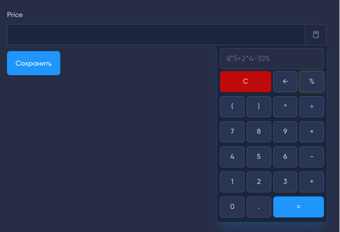

# Input extension - calculator

[](https://github.com/forest-lynx/moonshine-input-extension-calculator)
[](https://github.com/forest-lynx/moonshine-input-extension-calculator) 
[](LICENSE)\
[](Laravel) 
[](PHP) 
[](https://github.com/moonshine-software/moonshine)

Input extension to display a calculator by the field to the [MoonShine](https://moonshine-laravel.com/) admin panel. 

## Contents
* [Installation](#installation)
* [Usage](#usege)
* [License](#license)

## Installation
Command to install:
```bash
composer require forest-lynx/moonshine-input-extension-calculator
```
## Usage
```php
<?php
//...
use ForestLynx\MoonShine\InputExtensions\Calculator;
//...
Text::make('Price')
    ->extension(new Calculator());
//or
Text::make('Price')
    ->extension(new Calculator(isKeyboard: false));
```
There is a non-required parameter `isKeyboard`, default `true`, which is responsible for displaying the calculator with keyboard.
How it looks like in the admin panel:
|With Keyboard|Without Keyboard|
|:--:|:--:|
|||

>[!NOTE]
>`Ctrl+Alt+c` key combination is available to activate the calculator when the field is active, or by the field extension button.

Key presses are tracked when the calculator is active, the following values are available - `[0-9]`, `+`, `-`, `*`, `/`, `=`, `%`, `^`, `.`, `,` , `(`, `)`, `Backspace`, `Enter`, `Escape`.
Description of some values:
- `%` - calculation of a percentage,
- `^` - ascending to a degree,
- `Backspace` - deletion of the last character,
- `Enter` - calculation,
- `Escape` - clearing the field.

> There is support for a field with `number` type, which means that the minimum, maximum and step values of the field are taken into account.

> [!TIP]
> The [alpinejs mask](https://alpinejs.dev/plugins/mask) input mask for numeric values in fields is supported, including x-mask:dynamic but only for [$money](https://alpinejs.dev/plugins/mask#money-inputs). After the formula is calculated, the values in the field come formatted according to the mask.

## License
[MIT Licence](LICENSE).
